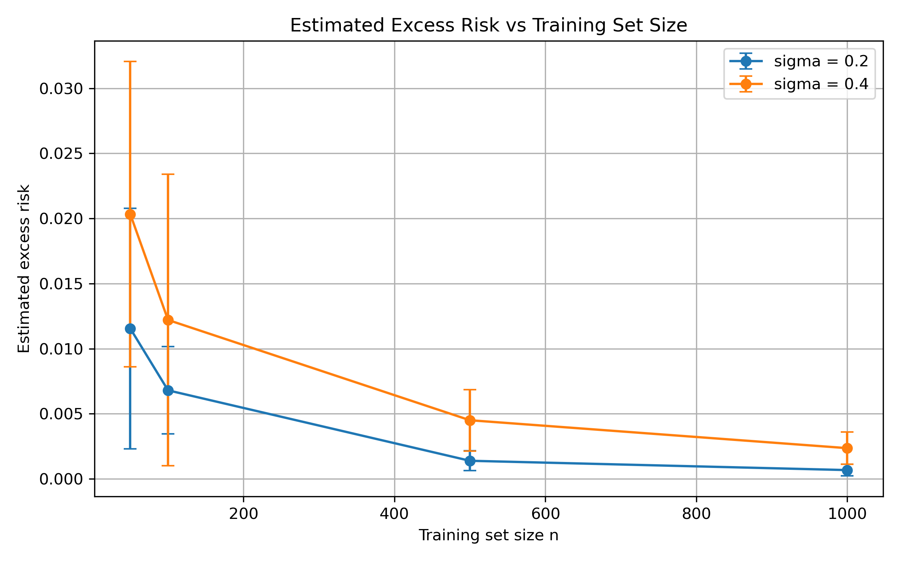
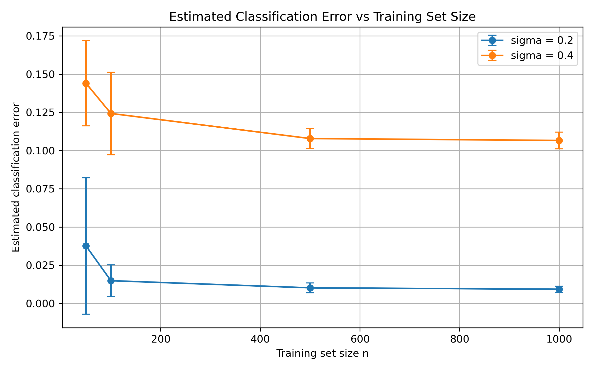

# SGD Project - ML5523

## Overview
This project implements **Projected Stochastic Gradient Descent (SGD)** for logistic regression and evaluates its performance under varying training set sizes and noise levels.

The goal is to study how SGD behaves in practice and compare empirical results with theoretical expectations from convex learning.

## Problem Setup

- Feature dimension: `d = 4`
- Parameter dimension: `5` (includes bias)
- Feature space: unit ball in `R^4`
- Parameter space: unit ball in `R^5`

### Logistic Loss
The loss function is:

`l(w, (x, y)) = log(1 + exp(-y <w, x_tilde>))`

where:

- `x_tilde = (x, 1)`
- `y in {-1, +1}`

## Algorithm

We implement **Projected Stochastic Gradient Descent**:

1. Initialize `w_1 = 0`
2. For each iteration `t`:
   - compute the stochastic gradient using one training example
   - update the parameter vector
   - project the updated vector back onto the unit ball
3. Use step size:

`eta_t = 1 / sqrt(t)`

The final predictor is the **average of the iterates**.

## Data Generation

Each example is generated as follows:

- choose `y` uniformly from `{-1, +1}`
- if `y = -1`, sample from a Gaussian centered at `(-1/4, -1/4, -1/4, -1/4)`
- if `y = +1`, sample from a Gaussian centered at `(1/4, 1/4, 1/4, 1/4)`
- project the sampled vector onto the unit ball to obtain `x`

## Experiments

Parameters used:

- `sigma in {0.2, 0.4}`
- `n in {50, 100, 500, 1000}`
- test set size `N = 400`
- `30` trials per setting

Metrics evaluated:

- logistic loss
- classification error
- excess risk = `mean - min`

## Results

### Key observations
- Increasing `n` reduces excess risk and classification error
- Higher noise (`sigma = 0.4`) leads to worse performance
- Variance across trials decreases as training size increases

## Plots

### Excess Risk vs Training Size


### Classification Error vs Training Size


## Project Structure

```text
SGD-Project-ML5523/
├── results/
│   ├── excess_risk_plot.png
│   └── classification_error_plot.png
├── .gitignore
├── README.md
├── report_notes.txt
└── sgd_project.py
